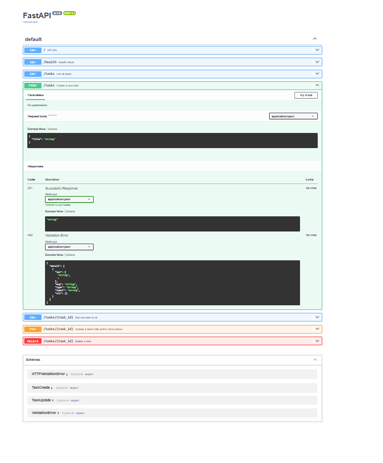

# Task API

A small CRUD API for managing a to-do list, built with FastAPI. Data lives in memory only — it resets when the server restarts (no database yet).

## Run it

​```bash
pip install fastapi uvicorn
uvicorn main:app --reload
​```

The API runs at `http://127.0.0.1:8000`. Interactive docs (Swagger UI) are available at `http://127.0.0.1:8000/docs`.

## Endpoints

| CRUD operation | Method | Path             | Description                          |
|-----------------|--------|-------------------|--------------------------------------|
| —               | GET    | `/`               | API info                             |
| —               | GET    | `/health`         | Health check                         |
| Read            | GET    | `/tasks`          | List all tasks                       |
| Read            | GET    | `/tasks/{id}`     | Get one task by id (404 if missing)  |
| Create          | POST   | `/tasks`          | Create a task (400 if title missing) |
| Update          | PUT    | `/tasks/{id}`     | Update title and/or done status      |
| Delete          | DELETE | `/tasks/{id}`     | Delete a task (204 on success)       |

## Example request

​```
$ curl -i http://127.0.0.1:8000/tasks/1
HTTP/1.1 200 OK
content-type: application/json

{"id":1,"title":"Buy milk","done":false}
​```

## Swagger UI



## The mortality experiment

Created a task, restarted the server, ran `GET /tasks` again — the new task was gone, back to the original 3 seed tasks. That's expected: everything lives in a Python list in memory, so it only exists as long as the process is running. Fixing this (making data survive a restart) is what a real database is for — which is next week's topic.